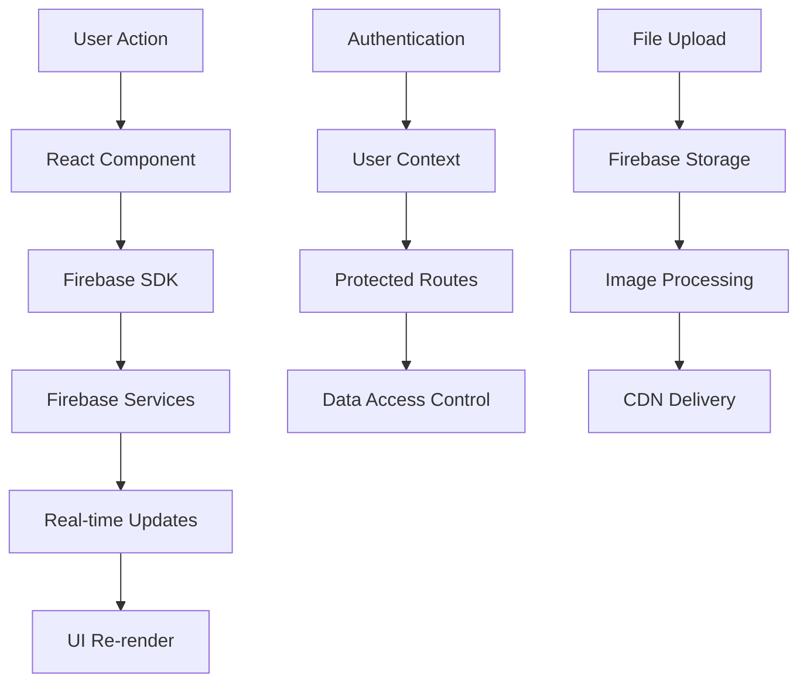

# 📋 When & Where - Product Analysis & Technical Documentation

## 🎯 Product Overview

**When & Where** is a comprehensive travel planning application designed to help users organize, document, and preserve their travel experiences through an intuitive and elegant interface.

### Problem Statement
Travelers struggle to:
- Organize trip information across multiple platforms
- Preserve memories in an organized, searchable format
- Share travel experiences with friends and family
- Access trip information offline or across devices
- Create meaningful time-delayed content (time capsules)

### Solution Approach
A centralized, real-time travel planning platform that combines:
- **Planning**: Timeline-based trip organization
- **Documentation**: Multi-format memory capture
- **Preservation**: Time-delayed memory capsules
- **Sharing**: Public trip sharing capabilities
- **Accessibility**: Multi-language and device support

## 🏗️ Technical Architecture

### System Architecture Diagram

```
┌─────────────────────────────────────────────────────────────┐
│                        Frontend Layer                        │
├─────────────────────────────────────────────────────────────┤
│  Next.js 14 App Router │ React 18 │ TypeScript │ Tailwind   │
│  ┌─────────────────┐   │ ┌──────┐ │ ┌───────┐  │ ┌───────┐  │
│  │   Pages/API     │   │ │ Hooks│ │ │ Types │  │ │ Styles│  │
│  │   Routes        │   │ │ State│ │ │ Utils │  │ │ Theme │  │
│  └─────────────────┘   │ └──────┘ │ └───────┘  │ └───────┘  │
└─────────────────────────────────────────────────────────────┘
                                │
                                ▼
┌─────────────────────────────────────────────────────────────┐
│                      Firebase Backend                        │
├─────────────────────────────────────────────────────────────┤
│  ┌──────────────┐ ┌──────────────┐ ┌─────────────────────┐  │
│  │   Auth       │ │   Firestore  │ │      Storage        │  │
│  │              │ │              │ │                     │  │
│  │ • Google OAuth│ │ • Real-time  │ │ • Trip Covers       │  │
│  │ • Email/Pwd  │ │ • NoSQL      │ │ • Memory Photos     │  │
│  │ • Session Mgmt│ │ • Offline    │ │ • CDN Integration   │  │
│  └──────────────┘ │ • Scalable   │ │ • Image Optimization│  │
│                   └──────────────┘ └─────────────────────┘  │
└─────────────────────────────────────────────────────────────┘
```

### Data Flow Architecture



## 🎨 UX/UI Design Decisions

### Design System

#### Color Palette
```css
/* Primary Theme - Teal */
--primary: 20 184 166;      /* #14B8A6 */
--primary-foreground: 255 255 255;

/* Secondary Themes */
--purple: 147 51 234;       /* #9333EA */
--blue: 59 130 246;         /* #3B82F6 */
--pink: 236 72 153;         /* #EC4899 */
```

#### Typography Scale
```css
/* Font Hierarchy */
--font-sans: 'Inter', system-ui, sans-serif;
--text-xs: 0.75rem;    /* 12px */
--text-sm: 0.875rem;   /* 14px */
--text-base: 1rem;     /* 16px */
--text-lg: 1.125rem;   /* 18px */
--text-xl: 1.25rem;    /* 20px */
```

### User Experience Principles

#### 1. **Progressive Disclosure**
- Onboarding flow introduces features gradually
- Advanced features hidden behind simple interfaces
- Contextual help and tooltips

#### 2. **Visual Hierarchy**
- Clear information architecture
- Consistent spacing and typography
- Color coding for different content types

#### 3. **Accessibility First**
- WCAG AA compliance
- Keyboard navigation support
- Screen reader optimization
- High contrast ratios

#### 4. **Mobile-First Design**
- Responsive breakpoints
- Touch-friendly interactions
- Optimized for thumb navigation

### Component Architecture

```typescript
// Component Hierarchy
App
├── AuthProvider
├── Layout
│   ├── Navigation
│   ├── Sidebar
│   └── Main Content
│       ├── TripList
│       ├── TripDetail
│       │   ├── Timeline
│       │   ├── Memories
│       │   └── Gallery
│       └── Settings
└── Modals
    ├── NewTripForm
    ├── NewMemoryForm
    └── ImageUpload
```

## 🔧 Technical Implementation Details

### State Management Strategy

```typescript
// Global State Structure
interface AppState {
  auth: {
    user: User | null;
    loading: boolean;
  };
  trips: {
    data: Trip[];
    loading: boolean;
    error: string | null;
  };
  ui: {
    theme: Theme;
    language: Language;
    sidebar: {
      open: boolean;
    };
  };
}
```

### Firebase Integration Patterns

#### Real-time Data Synchronization
```typescript
// Firestore Listener Pattern
export function listenUserTrips(userId: string, callback: (trips: Trip[]) => void) {
  const colRef = collection(db, "trips");
  
  return onSnapshot(
    query(colRef, where("userId", "==", userId), orderBy("createdAt", "desc")),
    (snapshot) => {
      const trips = snapshot.docs.map(doc => ({
        id: doc.id,
        ...doc.data()
      }));
      callback(trips);
    },
    (error) => {
      console.error("Error listening to trips:", error);
      // Fallback to offline data
    }
  );
}
```

#### Image Upload with Optimization
```typescript
// Firebase Storage Upload with Resize
export async function uploadTripCover(file: File): Promise<string> {
  // Resize image to optimal dimensions
  const resizedFile = await resizeImage(file, { width: 1000, height: 200 });
  
  // Generate unique filename
  const fileName = `trip-covers/${Date.now()}-${file.name}`;
  
  // Upload to Firebase Storage
  const storageRef = ref(storage, fileName);
  await uploadBytes(storageRef, resizedFile);
  
  // Get public URL
  return await getDownloadURL(storageRef);
}
```

### Performance Optimizations

#### 1. **Code Splitting**
```typescript
// Dynamic imports for heavy components
const PhotoGallery = dynamic(() => import('./PhotoGallery'), {
  loading: () => <LoadingSkeleton />
});
```

#### 2. **Image Optimization**
- Next.js Image component with automatic optimization
- WebP format support
- Lazy loading for gallery images
- Responsive image sizing

#### 3. **Bundle Analysis**
```bash
# Analyze bundle size
npm run build
npm run analyze
```

### Security Implementation

#### Firebase Security Rules

**Firestore Rules:**
```javascript
rules_version = '2';
service cloud.firestore {
  match /databases/{database}/documents {
    // Users can only access their own data
    match /users/{userId} {
      allow read, write: if request.auth != null && request.auth.uid == userId;
    }
    
    // Trips are user-scoped
    match /trips/{tripId} {
      allow read, write: if request.auth != null && 
        resource.data.userId == request.auth.uid;
    }
    
    // Memories are user-scoped
    match /memories/{memoryId} {
      allow read, write: if request.auth != null && 
        resource.data.userId == request.auth.uid;
    }
  }
}
```

**Storage Rules:**
```javascript
rules_version = '2';
service firebase.storage {
  match /b/{bucket}/o {
    // User can only upload to their own folder
    match /users/{userId}/{allPaths=**} {
      allow read, write: if request.auth != null && request.auth.uid == userId;
    }
    
    // Trip covers are public read, authenticated write
    match /trip-covers/{allPaths=**} {
      allow read: if true;
      allow write: if request.auth != null;
    }
  }
}
```

## 📊 Analytics & Monitoring

### Key Performance Indicators (KPIs)

#### User Engagement
- **Trip Creation Rate**: Trips created per user per month
- **Memory Capture Rate**: Memories added per trip
- **Time Capsule Usage**: Percentage of users creating time capsules
- **Gallery Interaction**: Photos viewed per session

#### Technical Metrics
- **Page Load Time**: < 2 seconds
- **Time to Interactive**: < 3 seconds
- **Error Rate**: < 1%
- **Uptime**: 99.9%

### Error Tracking
```typescript
// Error Boundary Implementation
class ErrorBoundary extends React.Component {
  componentDidCatch(error: Error, errorInfo: ErrorInfo) {
    // Log to monitoring service
    console.error('Error caught by boundary:', error, errorInfo);
    
    // Report to Firebase Crashlytics (future implementation)
    // crashlytics().recordError(error);
  }
}
```

## 🚀 Deployment Strategy

### Environment Configuration

#### Development
```bash
# Local development with Firebase Emulator
npm run dev
firebase emulators:start
```

#### Staging
```bash
# Deploy to Vercel preview
npx vercel --env=staging
```

#### Production
```bash
# Deploy to Vercel production
npx vercel --prod
```

### CI/CD Pipeline

```yaml
# .github/workflows/deploy.yml
name: Deploy to Production

on:
  push:
    branches: [main]

jobs:
  deploy:
    runs-on: ubuntu-latest
    steps:
      - uses: actions/checkout@v3
      - uses: actions/setup-node@v3
        with:
          node-version: '18'
      - run: npm ci
      - run: npm run test
      - run: npm run build
      - uses: amondnet/vercel-action@v20
        with:
          vercel-token: ${{ secrets.VERCEL_TOKEN }}
          vercel-org-id: ${{ secrets.ORG_ID }}
          vercel-project-id: ${{ secrets.PROJECT_ID }}
```

## 🔮 Future Roadmap

### Phase 1: Enhanced Collaboration (Q2 2024)
- **Multi-user trips**: Invite friends to collaborate
- **Real-time editing**: Live updates when multiple users edit
- **Permission system**: Owner, editor, viewer roles
- **Comments system**: Discuss trip details

### Phase 2: Advanced Features (Q3 2024)
- **Map integration**: Interactive trip maps with Google Maps
- **Weather integration**: Real-time weather for destinations
- **Expense tracking**: Built-in budget management
- **PDF export**: Beautiful trip itineraries

### Phase 3: AI & Automation (Q4 2024)
- **Smart suggestions**: AI-powered trip recommendations
- **Auto-categorization**: Automatic memory tagging
- **Voice notes**: Speech-to-text for memories
- **Smart search**: Natural language search queries

### Phase 4: Platform Expansion (Q1 2025)
- **Mobile apps**: Native iOS and Android apps
- **API access**: Public API for third-party integrations
- **Webhook system**: Real-time notifications
- **Enterprise features**: Team and organization accounts

## 📈 Success Metrics

### User Adoption
- **Monthly Active Users (MAU)**: Target 10K by end of year
- **User Retention**: 70% monthly retention rate
- **Feature Adoption**: 60% of users create time capsules

### Technical Performance
- **Core Web Vitals**: All metrics in "Good" range
- **Accessibility Score**: 100% WCAG AA compliance
- **Bundle Size**: < 250KB main bundle
- **Test Coverage**: > 80% code coverage

### Business Metrics
- **User Satisfaction**: 4.5+ star rating
- **Support Tickets**: < 5% of users need support
- **Feature Requests**: Track and prioritize user feedback

---

*This document is living and will be updated as the product evolves and new insights are gained.*
